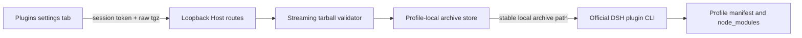

# Architecture

## Ownership and flow

The browser owns file selection and visible state only. It receives a process-scoped anti-CSRF token from the read route, then sends the raw file body to the mutation route. Multipart forms are not supported, which keeps filename parsing out of the Host.

The Host streams the compressed body once to a generated incoming file while enforcing `maxUploadBytes`. The archive validator then streams gzip and tar parsing without extracting entries. It meters expanded bytes and entry count, rejects unsafe entry types and paths, projects a small manifest subset, and verifies every declared entry before returning trusted package facts.

The archive store moves a validated file to `<profile>/<archiveStoreDir>/<sha256(package-name)>/<sha256(archive)>.tgz` and writes a pending sidecar. The official DSH CLI installs that persistent path. Success writes `current.json`, removes the pending marker, and prunes prior archives for the same package. Failure removes the new archive. Startup recovery commits a pending archive only when the Profile manifest already references its exact path; otherwise it removes it.

The CLI subprocess invokes the current DSH entry through the current Node executable. The command is `plugin --profile <profile> add <archive> --offline --ignore-scripts --save-exact`. DeepSeek Harness remains the owner of Profile initialization, pnpm invocation, package-name resolution, and `dsh.profile.bundles` reconciliation.

## Lifecycle

`InstallCoordinator` holds one slot across upload, validation, storage, and CLI execution. A request abort is forwarded to the shared signal. Cordis unload first removes registered routes, aborts the active slot, waits for it to unwind, and then waits for the CLI runner. POSIX execution uses an owned process group; Windows termination uses `taskkill /t` with direct-process fallback.

Plugin activation is deliberately outside this flow. The running Loader retains its current graph. The page always reports `restartRequired: true`, and the next Profile process discovers the reconciled bundle and its Web client entry.
